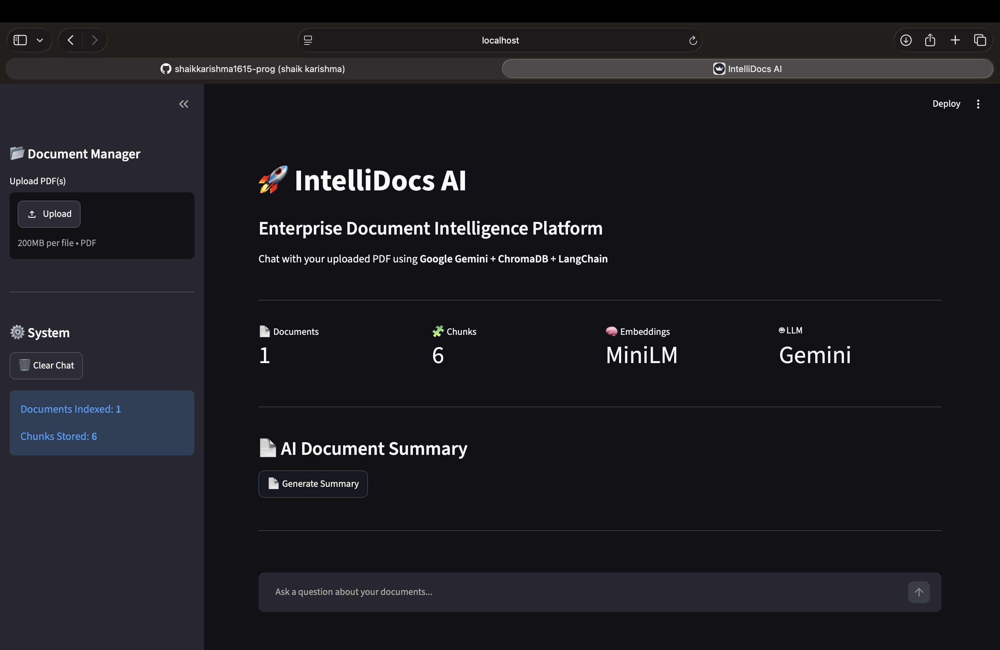
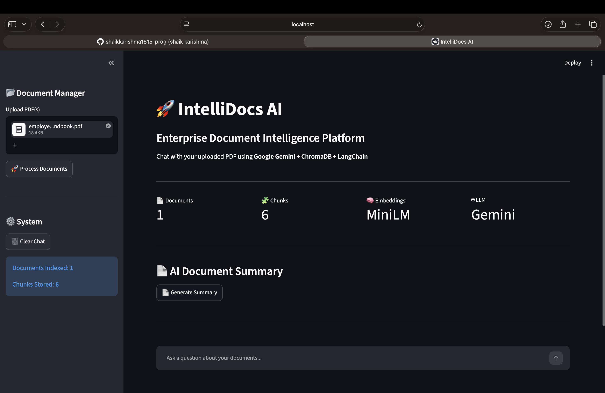
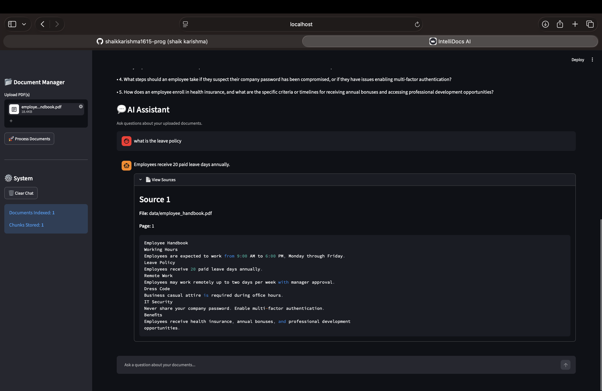
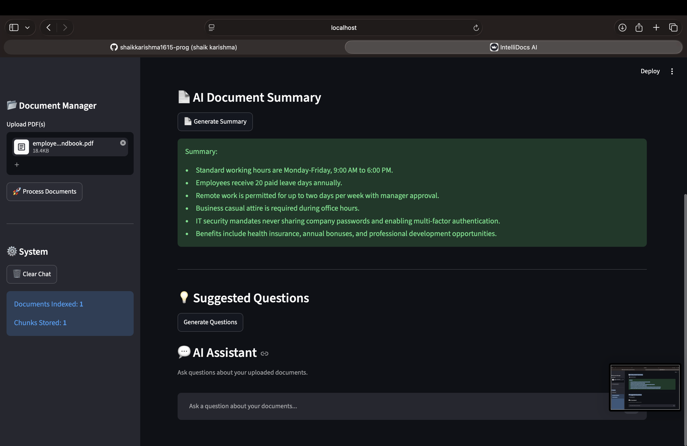
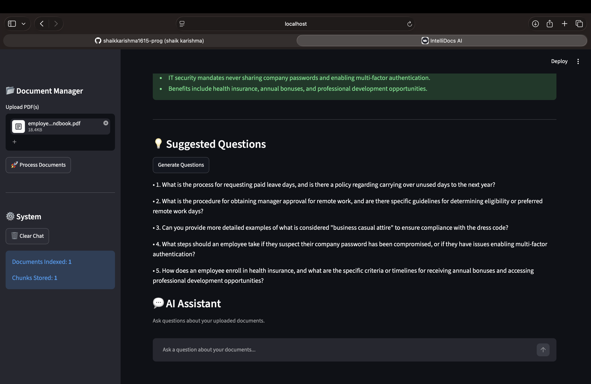

# IntelliDocs AI - Enterprise Document Intelligence System

An AI-powered Enterprise Document Intelligence platform that enables users to upload PDF documents, ask natural language questions, generate summaries, and retrieve accurate answers using Retrieval-Augmented Generation (RAG).

---

## Features

-  Upload one or more PDF documents
-  Automatic document chunking
-  MiniLM sentence embeddings
- ChromaDB vector database
- Semantic similarity search
-  Google Gemini 2.5 Flash integration
- AI-powered Question Answering
-  AI-generated Document Summary
-  Suggested Questions Generator
- Source Citation Support
-  FastAPI REST APIs
- Streamlit User Interface
- Logging
-  Docker Support

# Run Streamlit:

⁠ bash
streamlit run streamlit_app.py
 ⁠

Run FastAPI:

⁠ bash
uvicorn api.main:app --reload
 ⁠

Swagger UI:

http://127.0.0.1:8000/docs

---

# Screenshots

##  Home Page

---

##  Upload Documents

---

##  AI Question Answering

---

##  AI Document Summary

---

##  Suggested Questions

---

#  Author

**Shaik Karishma**

Computer Science and Data Science

GitHub: https://github.com/shaikkarishma1615-prog
